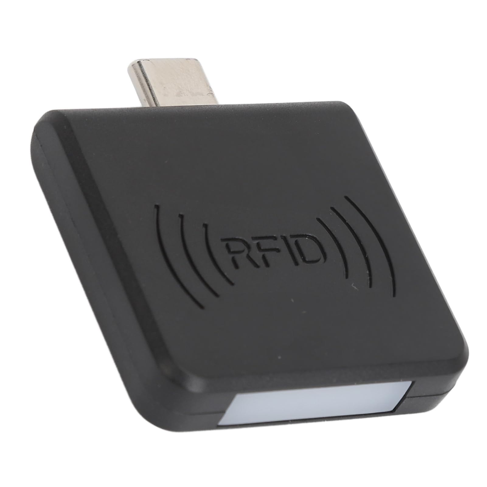
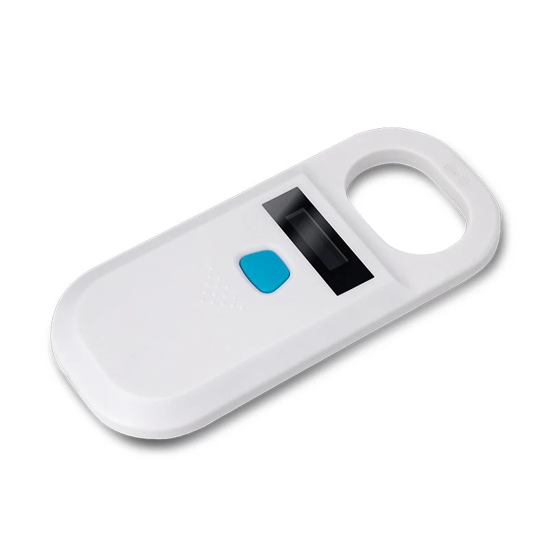
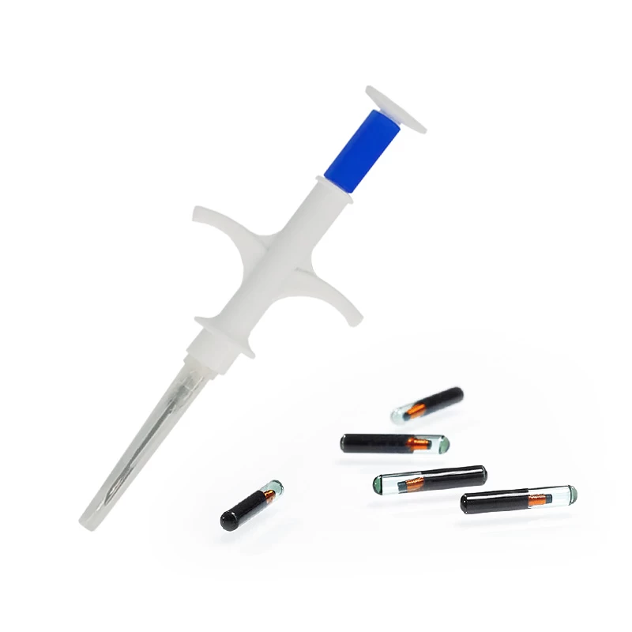

# 🐑 E-Farming - Sistem Pengelolaan Data Ternak Domba

E-Farming adalah aplikasi berbasis web yang digunakan untuk **pengelolaan data ternak domba**. Aplikasi ini dirancang untuk membantu peternak dalam memantau identitas, dan bobot, serta terintegrasi dengan **RFID reader** untuk identifikasi otomatis domba yang telah ditanamkan **RFID microchip**.

---

## ✨ Fitur Utama

-   **📋 Data Domba**

    -   Input identitas domba (ID, nama, jenis kelamin, ras, tanggal lahir, dsb).
    -   Menampilkan detail domba dalam bentuk profil.
    -   Cetak **sertifikat domba dalam format PDF** yang berisi data identitas lengkap.

-   **⚖️ Monitoring Bobot Domba**

    -   Input bobot hasil penimbangan.
    -   Menyimpan **riwayat penimbangan** per domba.

-   **🔖 Integrasi RFID**

    -   Setiap domba diberi **RFID microchip** yang disuntikkan ke leher.
    -   Integrasi dengan **USB RFID** untuk identifikasi cepat domba.

-   **📑 Laporan & Dokumentasi**
    -   Export sertifikat dalam format PDF.
    -   Laporan perkembangan bobot per periode.

---

## 🛠️ Teknologi

-   **Framework**: Laravel (PHP) dengan AdminLTE sebagai UI.
-   **Database**: MySQL/MariaDB.
-   **Frontend**: Blade Template + Bootstrap (AdminLTE).
-   **Integrasi Hardware**: USB RFID Reader Keyboard.
-   **PDF Generator**: DomPDF / Laravel Snappy.

---

## 📸 Hardware yang Digunakan

### 1. RFID Reader




### 2. RFID Microchip + Injector



## 📂 Struktur Direktori

```
e-farming/
│── app/                # Core aplikasi Laravel
│── database/           # Migration & Seeder
│── public/             # File publik (css, js, images)
│── resources/views/    # Template blade (UI)
│── routes/             # Definisi route aplikasi
│── storage/            # File storage (pdf, logs, dsb)
│── .env                # Konfigurasi environment
│── README.md           # Dokumentasi project
```

---

## 📖 Cara Penggunaan

1. **Login ke aplikasi** menggunakan akun admin.
2. **Tambahkan data domba** → isi identitas, lalu simpan.
3. **Scan RFID domba** menggunakan USB RFID reader → otomatis tampil data domba.
4. **Catat bobot terbaru** → sistem menyimpan riwayat timbang.
5. **Cetak sertifikat domba (PDF)** jika diperlukan.

---

## 🐑 Skema Sistem

-   Domba diberi **RFID microchip** → disuntikkan ke leher.
-   Peternak menggunakan **USB RFID reader keyboard** → sistem membaca ID domba.
-   Data identitas & bobot tersimpan di database.
-   Aplikasi menyediakan **Mengelola data**

---

## 🚀 Instalasi & Konfigurasi

1. **Clone Repository**

    ```bash
    git clone https://github.com/username/e-farming.git
    cd e-farming
    ```

2. **Install Dependency**

    ```bash
    composer install
    npm install && npm run dev
    ```

3. **Konfigurasi Environment**

    - Copy file `.env.example` menjadi `.env`
    - Atur koneksi database:
        ```
        DB_DATABASE=efarming
        DB_USERNAME=root
        DB_PASSWORD=
        ```

4. **Generate Key & Migrasi Database**

    ```bash
    php artisan key:generate
    php artisan migrate --seed
    ```

    Proses `php artisan migrate --seed` akan menjalankan **migration** dan **seeder** untuk mengisi data dummy ke database.

5. **Jalankan Aplikasi**
    ```bash
    php artisan serve
    ```

---
